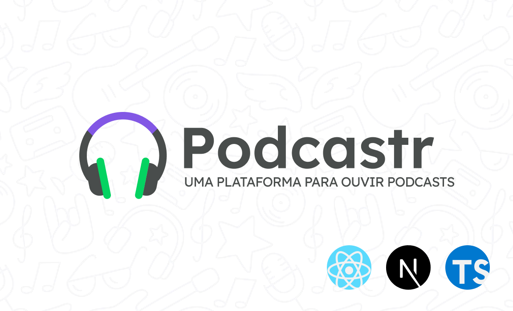
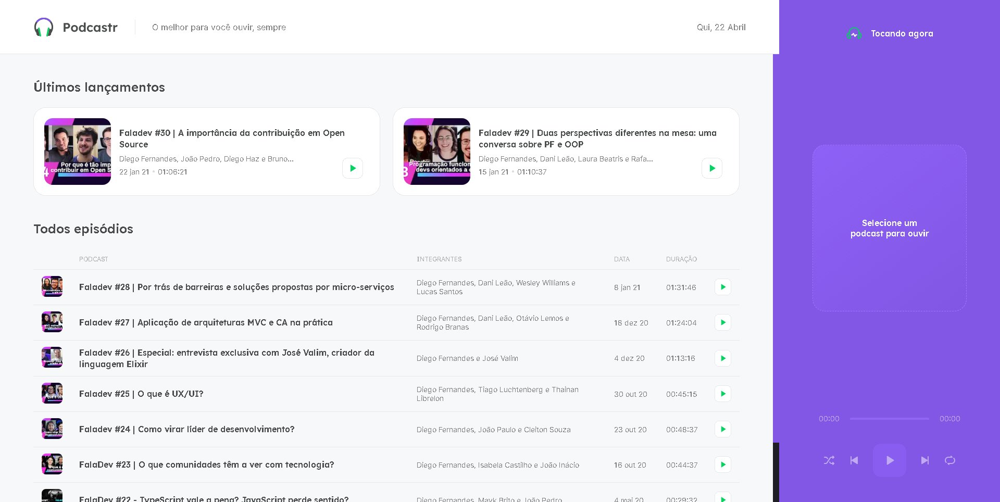

<h1 align="center">
  
</h1>

  <a href="#-tecnologias">Tecnologias</a>&nbsp;&nbsp;&nbsp;|&nbsp;&nbsp;&nbsp;
  <a href="#-projeto">Projeto</a>
  &nbsp;&nbsp;&nbsp;|&nbsp;&nbsp;&nbsp;
  <a href="#-como-executar">Como usar</a>

 

 

  

  

## 🚀 Tecnologias

Esse projeto foi desenvolvido com as seguintes tecnologias:

- Next.js
- Typescript
- SASS
- ESLint
- Prettier

## 💻 Projeto

O Podcastr vem a ser uma plataforma onde você pode ouvir podcasts durante a navegação na plataforma, também podendo ler artigo destinado aquele podcast que está ouvindo.

## 👨🏼‍💻 Como executar

- Clone o repositório
- Instale as dependências com `yarn install`
- Após a instalação das dependências inicie a API com `yarn server`.
- Inicie o servidor com `yarn dev`.

E pronto a aplicação estára rodando e também pode ser acessada em [`localhost:3000`](http://localhost:3000)

## 🌟 Desafios

A seguir um to-do com possiveis desafios para serem realizados nesse projeto.

- [ ] Torna o podcastr totalmente responsivo.
- [ ] Adicionar theme dark
- [ ] Transforma o podcastr em um aplicativo desktop com Electron
- [ ] Transforma o podcastr em uma PWA

---
